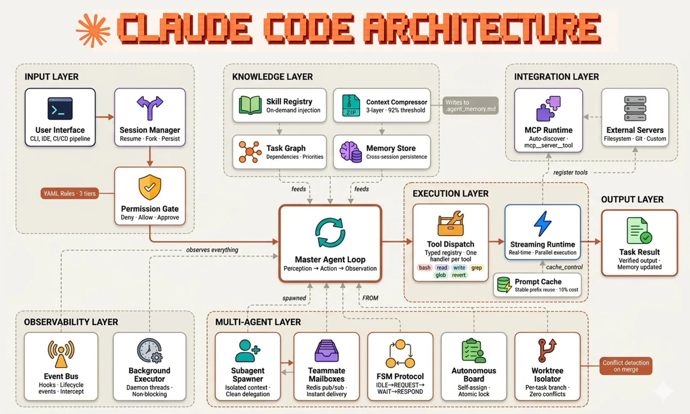

# Agent Harness Engineering

## Summary

An agent is an AI model plus all the infrastructure built around it. Harness engineering is the discipline of designing, building, and maintaining this infrastructure.

### Definition

According to Simon Willison:
```
Coding Agent = AI Model(s) + Harness
```

### What is a Harness?

The harness comprises the supporting systems and components:
- **Context Management** - Memory, state, and conversation history
- **Prompts** - System prompts, instructions, and templates
- **Tools** - Functions and APIs the agent can invoke
- **Connectors** - Integrations with external services
- **MCP** - Model Context Protocol for standardized tool communication

### Philosophy

Harness engineering is fundamentally a discipline rather than a prescriptive framework.

### Fareed Khan architecture


## Related topics:
- Long-horizon execution
- Self improving agents

## Sources
- https://addyosmani.com/blog/agent-harness-engineering/
